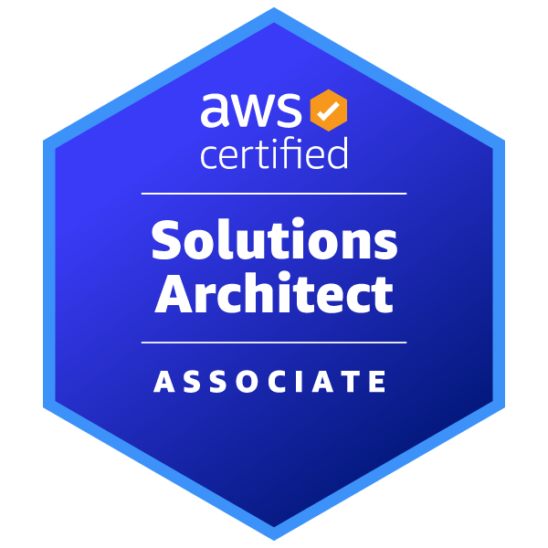

<h1 align="center">👨‍💻 Hi, I'm Ashutosh Lodha</h1>

<h3 align="center">
Platform Engineer | Cloud & DevOps Engineer | AWS Certified Solutions Architect – Associate
</h3>

Building cloud-native platforms, Kubernetes infrastructure, and distributed backend systems.

Focused on <b>Go</b>, <b>Kubernetes</b>, <b>Terraform</b>, <b>AWS</b>, and scalable cloud architecture.

  

  

  

  

  

  

---

### ⚙️  Cloud Native & Platform Engineering

<table align="center">
<tr>

<td align="center" width="100">
 AWS
</td>

<td align="center" width="100">
 Linux
</td>

<td align="center" width="100">
 Go
</td>

<td align="center" width="100">
 Docker
</td>

<td align="center" width="100">
 Kubernetes
</td>
 
<td align="center" width="100">
 Helm
</td>

<td align="center" width="100">
 Terraform
</td>

<td align="center" width="100">
 NGINX
</td>

</tr>
</table>

---

### 💻 Application Development + CI/CD

<table align="center">
<tr>

<td align="center" width="100">
 NodeJS
</td>

<td align="center" width="100">
 Express
</td>

<td align="center" width="100">
 JavaScript
</td>

<td align="center" width="100">
 HTML
</td>

<td align="center" width="100">
 CSS
</td>

<td align="center" width="100">
 Python
</td>

<td align="center" width="100">
 Git
</td>

<td align="center" width="120">
 ArgoCD
</td>

<td align="center" width="120">
 Jenkins
</td>

</tr>
</table>

---

### 🌐 Databases

<table align="center">
<tr>

<td align="center" width="100">
 Redis
</td>

<td align="center" width="100">
 MongoDB
</td>

<td align="center" width="100">
 PostgreSQL
</td>

</tr>
</table>

---

### 📡 Monitoring & Observability

<table align="center">
<tr>

<td align="center" width="120">
 Prometheus
</td>

<td align="center" width="120">
 Grafana
</td>

</tr>
</table>
<!-- 
---

### 📘 Currently Exploring

<table align="center">
<tr>

<td align="center" width="120">
 Ansible
</td>

<td align="center" width="120">
 ArgoCD
</td>

<td align="center" width="120">
 Jenkins
</td>

<td align="center" width="100">
 GitHub Actions
</td>
-->
</tr>
</table>

---
